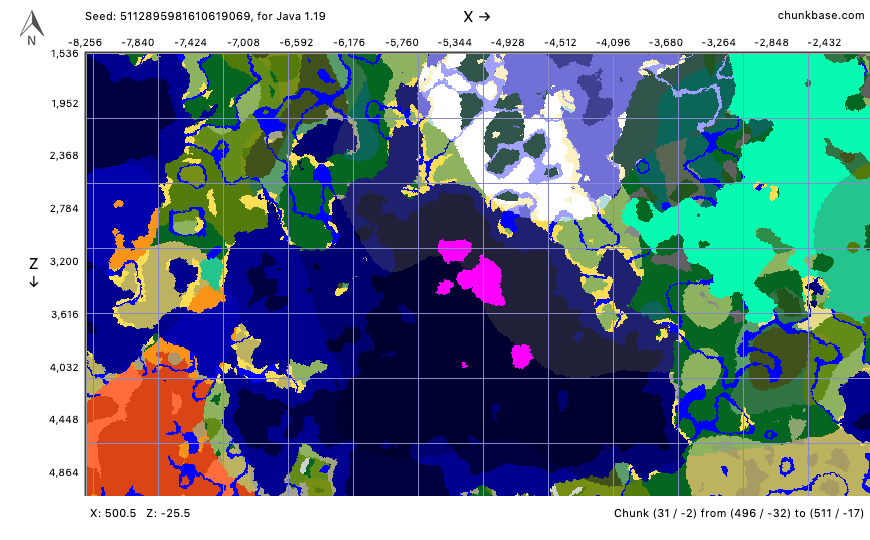

# 1.19 Mushroom Island Base

Zoomed In | Zoomed Out
--- | ---
 | 

## Nearby Features

- Mostly deep ocean
- Ocean monument: -5519, ?, 3232
- Mineshaft: -4934, 33, 3236

## Problems

Seemingly too few geodes nearby.
